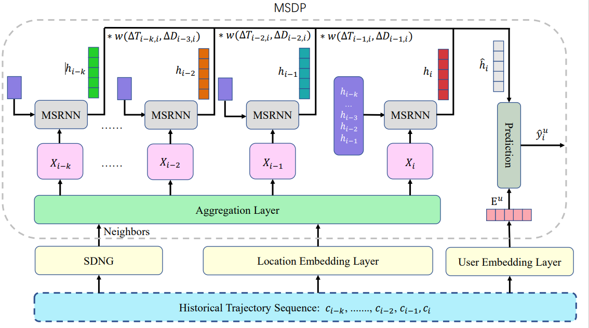

# Next-POI-Recommendation-with-Dynamic-Graph-and-Explicit-Dependency
AAAI 23

The pytorch environment is needed, and you should ensure the data folder and WORK folder in the directory of this file, whether they are empty or not is irrelevant.

1. If you want to run the code, you first need to follow the experiments section of the paper to download the Gowalla dataset.
   Then you will get the checkins-gowalla.txt

2. You need to put this Checkin file in the data folder, Then directly run the utils.py in RotatE_prepare folder.
   This process may take several minutes, please be patient. Then you will get the Count_gowalla.npy and Pdata_gowalla.npy in the data folder.

3. You need to open the RotatE folder, direct run the utils.py.
   This process only need several seconds, you will get entity_list_gowalla.npy, relation_dict_gowalla.npy, relation_only_pre_and_sub_gowalla.npy in the WORK folder.

4. directly runing the Graph_Trainer.py in the RotatE folder, In 2000 epochs, The program will end.
    you may get some temporary files, don't care about that.
    You will get the kge_model-gowalla.npy and coo_gowalla_neighbors.npz in the WORK folder.

5. run the spectral_clustering.py in RotatE
    This process will take a lot of time, almost half an hour, please be patient.   
    this process will  create the I.npy, list_centroids.npy, vecs_use.npy, list_number.npy  four files.

6. run the train_copy.py, you wiill get the WORK/dyn_network_30.pth. It is the pre-train neighbor graph.

7. run the train.py. It is the final step, you will get the best results in 35 epoch. 

